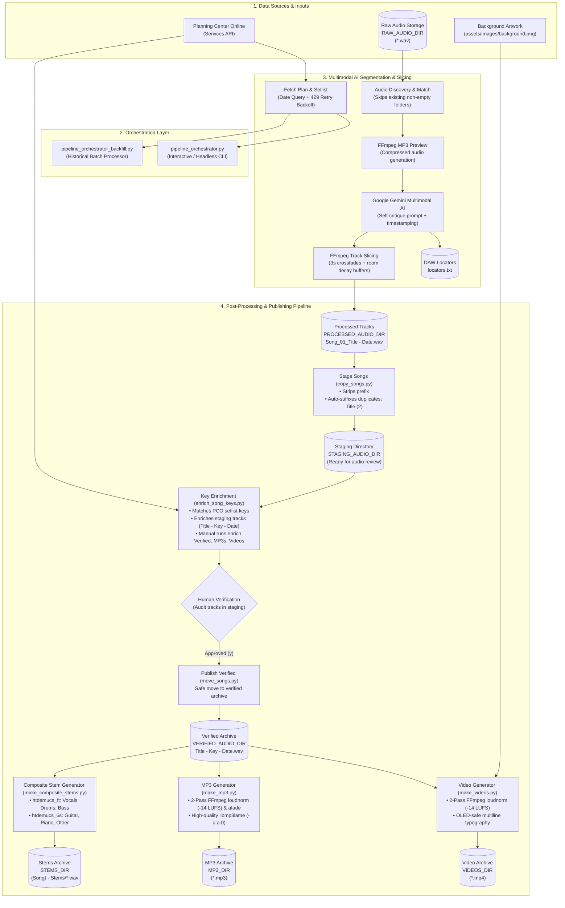

# 🎙️ Song Recording Catalog Pipeline

[](https://www.python.org/)
[](LICENSE)
[](run_tests.py)
[](.github/workflows/test.yml)

An end-to-end Python orchestration pipeline for music ministries and churches. This tool automates the tedious process of cataloging live service recordings by integrating directly with Planning Center Online (PCO), using Google Gemini's multimodal AI to intelligently segment raw master audio files, and preparing the final tracks for publication with FFmpeg-powered video and MP3 generation, Demucs hybrid composite stem separation, and automatic musical key enrichment.

## 🚀 Pipeline Features

1. **Planning Center Integration:** Automatically fetches recent or historical service plans and setlists via the PCO API with date-aware query filtering, eliminating manual data entry.
2. **Automated Audio Discovery & Multi-Recording Support:** Scans your raw recordings folder to automatically find all matching `.wav` files for a service date, intelligently skipping already-processed folders and segmenting only missing recordings.
3. **Multimodal AI Segmentation:** Leverages the latest Gemini Flash models with a strict "Self-Critique" loop to dynamically listen to the audio, avoid speech-bleed, and map precise timestamps for every song in the setlist.
4. **Precision FFmpeg Slicing:** Automatically applies 3-second crossfades and cuts the master `.wav` file into pristine, individual tracks.
5. **DAW Ready:** Generates tab-separated locator markers for seamless import into DAWs like Ableton Live.
6. **Automated Post-Processing & Publishing:** 
   - **Staging & Verification:** Strips AI-generated prefix metadata, safely adds suffix duplicate disambiguation (e.g., `Title (2)`), and stages tracks for human audio review before moving to verified archives.
   - **Musical Key Enrichment:** Automatically synchronizes with Planning Center Online to enrich song filenames with their musical keys across verified audio, MP3, and video folders, featuring full support for key changes/modulations (e.g., `In Christ Alone - D-E - 2026-09-13.mp4`).
   - **Video Generation:** Generates OLED-safe, multiline typography MP4 videos from your verified audio using a precise 2-pass `loudnorm` audio normalization.
   - **High-Quality MP3 Generation:** Converts verified audio into normalized MP3s with EBU R128 loudness normalization (`-14 LUFS`), smooth 3-second crossfades, and high-quality LAME variable bitrate encoding (`-q:a 0`).
   - **Composite Stem Separation:** Isolates 6-track stems (Vocals, Drums, Bass, Guitar, Piano, Other) using hybrid Demucs models (`htdemucs_ft` for rhythm and `htdemucs_6s` for chordal instruments) organized into dedicated per-song stem folders with 16-bit PCM WAV tracks.

---

## 🗺️ Pipeline Architecture & Workflow

The diagram below illustrates the end-to-end data flow: from initial Planning Center plan queries and raw multitrack audio discovery, through Gemini-powered multimodal AI segmentation, to automated staging, human verification, and broadcast video generation.



---

## 📋 Prerequisites

Before running the script, ensure you have the following installed on your machine:

1. **Python 3.10+**
2. **FFmpeg:** The script relies on FFmpeg for audio compression, precision slicing, and video rendering.
   * *macOS (Homebrew):* `brew install ffmpeg`
   * *Linux (Ubuntu/Debian):* `sudo apt update && sudo apt install -y ffmpeg libfontconfig1`
   * *Windows:* Download from [gyan.dev](https://www.gyan.dev/ffmpeg/builds/) and add to your system PATH.
3. **PyTorch & Demucs (Optional / For Stem Separation):** For composite stem extraction:
   ```bash
   pip install demucs torchaudio torch numpy torchcodec
   ```
   *Hardware Acceleration:* Automatically utilizes Apple Silicon MPS (`mps`), NVIDIA CUDA (`cuda`), or CPU.  
   *(Tip: For multi-machine deployments or offline environments, see the [Hugging Face & PyTorch Model Cache Guide](#-hugging-face--pytorch-model-cache-management-offline--multi-machine-setup) below).*
4. **Google Gemini API Key:** Generate one for free from Google AI Studio via [https://aistudio.google.com/api-keys](https://aistudio.google.com/api-keys).
5. **Planning Center API Keys:** Generate personal access tokens via [https://api.planningcenteronline.com/personal_access_tokens](https://api.planningcenteronline.com/personal_access_tokens).

---

## 🛠️ Installation & Setup

> 💡 **Architecture Note:** The core audio cataloging, PCO integration, and segmentation pipeline is a 100% standalone Python CLI application that runs locally or on servers. The repository also includes an optional Node.js web server (`server.js`) tailored for cloud-hosted interactive preview environments (such as Google AI Studio) with a live diff viewer. Running Node.js is completely optional for standard CLI usage.

1. **Clone the repository:**
   ```bash
   git clone https://github.com/yourusername/song-recording-catalog-pipeline.git
   cd song-recording-catalog-pipeline
   ```

2. **Install Python dependencies:**
   ```bash
   pip install -r requirements.txt
   ```

3. **Configure Environment Variables:**
   Copy the example environment file:
   ```bash
   cp .env.example .env
   ```
   Open the `.env` file and configure your API keys and folder structures:
   - `GEMINI_API_KEY`, `PCO_APP_ID`, `PCO_SECRET`
   - `PCO_SERVICE_TYPE_ID` *(Optional: If left blank, the CLI will prompt you to select a service type dynamically).*
   - Define your strict local/cloud drive folder paths: `RAW_AUDIO_DIR`, `PROCESSED_AUDIO_DIR`, `STAGING_AUDIO_DIR`, `VERIFIED_AUDIO_DIR`, `VIDEOS_DIR`.

---

## 💻 Usage & Workflows

The entire tool is orchestrated via a single command-line interface: `pipeline_orchestrator.py`.

### 1. The Full End-to-End Pipeline (Default)

To process a new service recording, simply run the orchestrator without any flags. When invoked with zero arguments, the orchestrator defaults to running the **entire end-to-end workflow**:

```bash
python3 pipeline_orchestrator.py
```

* **What it does automatically:** 
  1. Prompts you to select a service type and recent service from Planning Center.
  2. Fetches the setlist from PCO.
  3. Automatically discovers the matching raw audio file in `RAW_AUDIO_DIR`.
  4. Generates an MP3 preview and uses Gemini AI to determine precise song timestamps.
  5. Slices the audio into individual tracks inside `PROCESSED_AUDIO_DIR`.
  6. **Post-Processing (Stage Songs):** Copies and stages songs into `STAGING_AUDIO_DIR` (stripping the `Song_XX_` prefix and handling duplicates).
  7. **Post-Processing (Enrich Song Keys):** Synchronizes musical keys from Planning Center and updates filenames in `STAGING_AUDIO_DIR`.
  8. **Post-Processing (Publish Verified):** Prompts you to confirm moving verified tracks from `STAGING_AUDIO_DIR` to `VERIFIED_AUDIO_DIR`.
  9. **Post-Processing (Generate Videos):** Renders OLED-safe, loudness-normalized MP4 videos into `VIDEOS_DIR`.
  10. **Post-Processing (Generate MP3 Audio):** Converts verified audio into normalized MP3s with EBU R128 loudness normalization and crossfades in `MP3_DIR`.
  11. **Post-Processing (Generate Composite Stems):** Generates 6-track composite stems (vocals, drums, bass, guitar, piano, other) in `STEMS_DIR`.

*Fine-Grained Controls & Overrides:*
You can specify a date or date range to run segmentation only (interactively selecting the service type and plan without needing to look up IDs), adjust API query limits, bypass all menus for headless automation, or isolate specific stages:
```bash
# Run segmentation only for a specific date (prompts to select service type and plan):
python3 pipeline_orchestrator.py --date "2026-09-06"

# Run segmentation for a historical date (uses date-aware Planning Center query filtering):
python3 pipeline_orchestrator.py --date "2024-11-17"

# Run segmentation only for a date range (prompts to select plan(s) in range):
python3 pipeline_orchestrator.py --start-date "2026-08-01" --end-date "2026-08-31"

# Adjust the maximum number of plans fetched from Planning Center (defaults to 50 recent, 100 for date queries):
python3 pipeline_orchestrator.py --date "2024-11-17" --limit 150

# Advanced: Run segmentation headlessly (bypasses all prompts):
python3 pipeline_orchestrator.py --service-type "987654" --plan-id "123456" --date "2026-09-06"

# Run interactive segmentation only without post-processing
python3 pipeline_orchestrator.py --skip-post-processing

# Run segmentation for a specific audio file (with explicit post-processing)
python3 pipeline_orchestrator.py --audio-file "R_20260906-103109.wav" --publish-staging --publish-verified --make-videos
```

*Multiple Audio Recordings per Date:*
When a service date matches multiple raw `.wav` recordings (e.g., split recordings or morning/evening sessions), the orchestrator iterates through all discovered files. Any recording whose destination output folder already exists and is non-empty is safely skipped, allowing the pipeline to continue and process any remaining missing recordings.

### 2. Post-Processing: Publishing, Videos, MP3s & Key Enrichment

After the AI segments the audio, you can run post-processing steps individually or combined to stage, verify, enrich with musical keys, and generate videos or MP3s.

**Stage Songs (Date-Scoped):**
Prompts you to confirm before copying songs from `PROCESSED_AUDIO_DIR` to `STAGING_AUDIO_DIR`. It strips the AI numbering prefix (e.g., `Song_01_`) and safely copies files into your staging area without overwriting existing files.
- When running the interactive pipeline for a single Sunday, `--publish-staging` is **automatically scoped** to copy only that specific Sunday's songs.
- **Interactive Date Prompt (Default):** If no date flags are passed during standalone post-processing, the orchestrator interactively prompts you to select a single service date, a date range, or all songs:
  ```bash
  python3 pipeline_orchestrator.py --publish-staging
  ```
- For standalone post-processing of a specific date:
  ```bash
  python3 pipeline_orchestrator.py --publish-staging --date "2026-09-06"
  ```
- For post-processing a specific date range (inclusive):
  ```bash
  python3 pipeline_orchestrator.py --publish-staging --start-date "2026-08-01" --end-date "2026-08-31"
  ```
- To stage all songs regardless of date without prompting:
  ```bash
  python3 pipeline_orchestrator.py --publish-staging --all
  ```

**Publish Verified Songs:**
Prompts you to confirm if the recordings in `STAGING_AUDIO_DIR` have been manually verified. If you type 'y', it securely moves them into your `VERIFIED_AUDIO_DIR` without overwriting existing files.
- **Interactive Date Prompt (Default):** Prompts for date filter options (single date, date range, or all songs) if no date arguments are provided.
- Standalone execution:
  ```bash
  python3 pipeline_orchestrator.py --publish-verified
  ```
- Scoped to a specific date or date range:
  ```bash
  python3 pipeline_orchestrator.py --publish-verified --date "2026-09-06"
  python3 pipeline_orchestrator.py --publish-verified --start-date "2026-08-01" --end-date "2026-08-31"
  ```
- To move all verified songs without prompting for dates:
  ```bash
  python3 pipeline_orchestrator.py --publish-verified --all
  ```

**Generate Videos:**
Scans your `VERIFIED_AUDIO_DIR` for `.wav` files and generates OLED-safe, multiline text `.mp4` videos using a default `assets/images/background.png`. It uses a 2-pass FFmpeg `loudnorm` filter (I=-14, TP=-1) to guarantee perfect normalization for YouTube/Social Media.
- **Interactive Date Prompt (Default):** Prompts for date filter options (single date, date range, or all songs) if no date arguments are provided.
- Standalone execution:
  ```bash
  python3 pipeline_orchestrator.py --make-videos
  ```
- Scoped to a specific date or date range:
  ```bash
  python3 pipeline_orchestrator.py --make-videos --date "2026-09-06"
  python3 pipeline_orchestrator.py --make-videos --start-date "2026-08-01" --end-date "2026-08-31"
  ```
- To generate videos for all songs without prompting for dates:
  ```bash
  python3 pipeline_orchestrator.py --make-videos --all
  ```

**Generate MP3 Audio:**
Scans your `VERIFIED_AUDIO_DIR` for `.wav` files and converts them into normalized MP3s with EBU R128 loudness normalization (`-14 LUFS`), subtle 3-second audio crossfades (`afade`), and highest-quality LAME variable bitrate (`-codec:a libmp3lame -q:a 0`) in `MP3_DIR` for universal compatibility across devices, media players, and phones.
- **Interactive Date Prompt (Default):** Prompts for date filter options (single date, date range, or all songs) if no date arguments are provided.
- Standalone execution:
  ```bash
  python3 pipeline_orchestrator.py --make-mp3
  # or directly using the module:
  python3 -m post_processing.make_mp3
  ```
- Scoped to a specific date or date range:
  ```bash
  python3 pipeline_orchestrator.py --make-mp3 --date "2026-09-06"
  python3 pipeline_orchestrator.py --make-mp3 --start-date "2026-08-01" --end-date "2026-08-31"
  ```
- To generate MP3s for all songs without prompting for dates:
  ```bash
  python3 pipeline_orchestrator.py --make-mp3 --all
  ```

**Generate Composite Stems (Demucs AI):**
Separates source `.wav` files in `VERIFIED_AUDIO_DIR` into 6-track composite stems using a state-of-the-art dual-model Demucs strategy:
- **Model Strategy:**
  - **`htdemucs_ft` (Fine-Tuned 4-Stem):** Extracts ultra-clean **Vocals**, **Drums**, and **Bass**.
  - **`htdemucs_6s` (6-Stem):** Extracts **Guitar**, **Piano**, and **Other**.
- **Output Organization:** Each song creates its own subfolder in `STEMS_DIR` based on its filename (`STEMS_DIR/{input_filename} - Stems`), containing 16-bit PCM `.wav` files:
  - `{input_filename} - vocal.wav`
  - `{input_filename} - drums.wav`
  - `{input_filename} - bass.wav`
  - `{input_filename} - guitar.wav`
  - `{input_filename} - piano.wav`
  - `{input_filename} - other.wav`
- **Smart Skipping & Memory Management:** Skips separation if all 6 stems already exist (use `--overwrite` to re-generate). Automatically cleans up PyTorch tensors and triggers garbage collection between passes to prevent unified/GPU memory leaks.
- **Hardware Acceleration:** Auto-detects Apple Silicon (`mps`), NVIDIA CUDA (`cuda`), or falls back to CPU. You can force a specific device via `--device mps` or the `STEMS_DEVICE` environment variable.
- **Interactive Date Prompt (Default):** Prompts for date filter options (single date, date range, or all songs) if no date arguments are provided.
- Standalone execution:
  ```bash
  python3 pipeline_orchestrator.py --make-stems
  # or directly using the module:
  python3 -m post_processing.make_composite_stems
  ```
- Scoped to a specific date or date range:
  ```bash
  python3 pipeline_orchestrator.py --make-stems --date "2026-09-06"
  python3 pipeline_orchestrator.py --make-stems --start-date "2026-08-01" --end-date "2026-08-31"
  ```
- Direct module options (custom paths, forced re-separation, device):
  ```bash
  python3 -m post_processing.make_composite_stems --src-dir "/path/to/wavs" --dest-dir "/path/to/stems" --device mps --overwrite
  ```

#### 💾 Hugging Face & PyTorch Model Cache Management (Offline & Multi-Machine Setup)

When Demucs runs for the first time, it downloads pretrained neural network weights (`htdemucs_ft` and `htdemucs_6s`, ~300 MB to 1+ GB each) to your local cache. Depending on the Demucs release and PyTorch backend, these weights are stored in:
- **Hugging Face Hub Cache:** `~/.cache/huggingface/hub/`
- **PyTorch Hub Checkpoints:** `~/.cache/torch/hub/checkpoints/`

Pre-caching and copying this cache between machines is essential when:
- Deploying to headless Linux servers, cloud instances, or church production machines.
- Running in air-gapped venues or offline studios with limited or no internet access.
- Avoiding redundant multi-gigabyte downloads across team members or build environments.

##### 1. Locating the Cached Files
On your primary machine where Demucs has previously separated audio:
```bash
# Verify Hugging Face model cache (contains model snapshots and blobs)
ls -la ~/.cache/huggingface/hub/

# Verify PyTorch Hub checkpoints (contains pretrained .th and .pt files)
ls -la ~/.cache/torch/hub/checkpoints/
```

##### 2. Copying the Cache to Another Machine or Server

**Option A: Using `rsync` (Fastest & Recommended for SSH/Remote Hosts)**
```bash
# 1. Create target directories on the remote host
ssh user@remote-host "mkdir -p ~/.cache/huggingface ~/.cache/torch/hub/checkpoints"

# 2. Sync the Hugging Face cache (preserves directory structure and symlinks)
rsync -avzP ~/.cache/huggingface/ user@remote-host:~/.cache/huggingface/

# 3. Sync the PyTorch Hub checkpoints
rsync -avzP ~/.cache/torch/hub/checkpoints/ user@remote-host:~/.cache/torch/hub/checkpoints/
```

**Option B: Using Compressed Tarball (Ideal for USB drives, Cloud storage, or Air-gapped transfers)**
```bash
# On the source machine, create compressed archives:
tar -czvf hf_cache.tar.gz -C ~/.cache huggingface
tar -czvf torch_cache.tar.gz -C ~/.cache/torch hub

# On the destination machine, extract into ~/.cache:
mkdir -p ~/.cache ~/.cache/torch
tar -xzvf hf_cache.tar.gz -C ~/.cache/
tar -xzvf torch_cache.tar.gz -C ~/.cache/torch/
```

**Option C: In Docker Containers & Headless Deployments**
In your `Dockerfile`:
```dockerfile
# Copy pre-downloaded cache into the container image
COPY .cache/huggingface /root/.cache/huggingface
COPY .cache/torch /root/.cache/torch
```
Or mount your host cache dynamically at container runtime:
```bash
docker run -v ~/.cache/huggingface:/root/.cache/huggingface \
           -v ~/.cache/torch:/root/.cache/torch ...
```

##### 3. Configuring Demucs to Utilize the Cache

If the cache files are copied into the standard `~/.cache/huggingface` and `~/.cache/torch` locations on the destination machine, Demucs and PyTorch will detect and use them **automatically with zero configuration needed**.

If you copied the cache to a **custom directory** (e.g. an external SSD `/Volumes/FastDrive/cache` or shared network mount `/mnt/shared/models`), configure the paths via environment variables:

**In your shell (`~/.bashrc`, `~/.zshrc`) or terminal session:**
```bash
# Point Hugging Face to your custom directory
export HF_HOME="/path/to/custom/cache/huggingface"
export HF_HUB_CACHE="/path/to/custom/cache/huggingface/hub"

# Point PyTorch Hub to your custom directory
export TORCH_HOME="/path/to/custom/cache/torch"
```

**Or in your project's `.env` file:**
```bash
HF_HOME=/path/to/custom/cache/huggingface
HF_HUB_CACHE=/path/to/custom/cache/huggingface/hub
TORCH_HOME=/path/to/custom/cache/torch
```

##### 4. Enforcing Strictly Offline / Air-Gapped Operation

To guarantee that Demucs, Hugging Face, or PyTorch never attempt outbound HTTP network calls or repository check lookups (ideal for air-gapped church production computers), enable offline mode:

```bash
export HF_HUB_OFFLINE=1
export TRANSFORMERS_OFFLINE=1
```
*(You can also set `HF_HUB_OFFLINE=1` in your `.env` file).* When enabled, Demucs operates 100% locally from your transferred cache and will never reach out to remote servers.

**Enrich Song Keys (Planning Center Integration):**
Enriches song tracks with their musical keys from Planning Center (e.g., `<Title> - <Key> - <Date>.<ext>`).
- **Pipeline Stage (Staging):** When run in the post-processing pipeline, key enrichment executes right before songs are published to `VERIFIED_AUDIO_DIR`, so songs in `STAGING_AUDIO_DIR` are enriched prior to video, MP3, and stem generation.
- **Manual Runs (Verified / MP3 / Video Archives):** When invoked standalone (e.g. `--enrich-keys`), it scans and enriches existing files across `VERIFIED_AUDIO_DIR`, `MP3_DIR`, and `VIDEOS_DIR` (or custom directories).
- **Key Modulation Support:** Fully supports both single keys (`E`, `Bm`, `Eb/G`) and key modulations/transitions (e.g., `D-E`, `C-D-E`, `Eb-F`).
- **Heuristics & Clean Matching:** Uses exact title matching, normalized prefix heuristics, and parenthetical key extraction with automatic skipping for files that already have keys or where target filenames already exist.
- **Interactive Date Prompt (Default):** Prompts for date filter options (single date, date range, or all songs) if no date arguments are provided.
- Standalone execution:
  ```bash
  python3 pipeline_orchestrator.py --enrich-keys
  # or directly using the module:
  python3 -m post_processing.enrich_song_keys
  ```
- Scoped to a specific date or date range:
  ```bash
  python3 pipeline_orchestrator.py --enrich-keys --date "2026-09-13"
  python3 pipeline_orchestrator.py --enrich-keys --start-date "2026-09-01" --end-date "2026-09-30"
  ```
- Dry-run preview and custom directory targeting via the module:
  ```bash
  # Preview renames without modifying files on disk:
  python3 -m post_processing.enrich_song_keys --dry-run
  
  # Target specific directory:
  python3 -m post_processing.enrich_song_keys --dir "/path/to/media" --date "2026-09-13"
  ```

**Run Combined Post-Processing Stages:**
When running multiple post-processing flags together without CLI date args, the orchestrator prompts for the date filter once and applies it across all selected stages:
```bash
# Prompts for dates once, stages songs, enriches keys in staging, asks verification, and renders videos, MP3s, and stems:
python3 pipeline_orchestrator.py --publish-staging --enrich-keys --publish-verified --make-videos --make-mp3 --make-stems

# Or process all songs across all stages without date prompting:
python3 pipeline_orchestrator.py --publish-staging --enrich-keys --publish-verified --make-videos --make-mp3 --make-stems --all
```

*(Note: Ensure an image exists at `assets/images/background.png` or specify a custom path in the code for video generation to work.)*

### 3. Batch Processing / Backfilling

If you have a large archive of historical raw recordings and want to process them all at once, you can use the dedicated backfill orchestrator:

```bash
python3 pipeline_orchestrator_backfill.py
```

* **What it does:** 
  1. Interactively prompts you for a `Start Date` and `End Date` (YYYY-MM-DD).
  2. Fetches up to 100 recent plans from Planning Center and filters them down to your specified timeframe.
  3. Automatically searches your `RAW_AUDIO_DIR` for matching `.wav` files.
  4. Sequentially executes the Gemini AI segmentation on every matched date, wrapped in a fault-tolerant `try/except` loop so a single failure doesn't halt the entire batch.
  5. Respects API rate limits automatically by pausing between plans.
  6. Prints a final summary report of all successful and failed processing dates.

*Optional Overrides & In-Line Post-Processing:*
```bash
# Backfill with custom plan limit and automatic staging scoped strictly to the backfill timeframe (inclusive)
python3 pipeline_orchestrator_backfill.py --start-date "2024-01-01" --end-date "2024-12-31" --limit 200 --publish-staging

# Full end-to-end backfill with staging, verification prompt, video/MP3 rendering, stem generation, and key enrichment
python3 pipeline_orchestrator_backfill.py --start-date "2026-08-01" --end-date "2026-08-31" --publish-staging --publish-verified --make-videos --make-mp3 --make-stems --enrich-keys

# Run post-processing only (including stems and key enrichment) for a previous backfill timeframe (skips plan fetching and segmentation)
python3 pipeline_orchestrator_backfill.py --start-date "2026-08-01" --end-date "2026-08-31" --publish-staging --publish-verified --make-videos --make-mp3 --make-stems --enrich-keys --post-processing-only
```

*Logging Output & Errors to a File:*
```bash
python3 -u pipeline_orchestrator_backfill.py 2>&1 | tee tmp/backfill_report.txt
```

* **Next Steps After Backfill:**
If you ran backfill without `--publish-staging`, you can stage only the files from that backfill timeframe using `pipeline_orchestrator.py`:
```bash
# Stage only songs from the backfill timeframe:
python3 pipeline_orchestrator.py --publish-staging --start-date "2026-08-01" --end-date "2026-08-31"

# After listening and verifying in STAGING_AUDIO_DIR, publish, enrich keys, and generate videos/MP3s:
python3 pipeline_orchestrator.py --publish-verified --make-videos --make-mp3 --enrich-keys
```

---

## 🧪 Testing

The project includes a robust unit testing suite (164 tests) covering API interactions, timestamp math, string sanitization, hallucination prevention logic, file operations, dynamic FFmpeg command construction, and musical key enrichment.

To run the entire test suite across the repository, use the included test runner:
```bash
python3 run_tests.py
```

---

## 💻 Development Workflow (Google AI Studio Build)

This repository is optimized for rapid development and maintenance using **[Google AI Studio Build](https://aistudio.google.com/build)**. You can import, edit, test, and sync this codebase directly in the cloud using natural language prompts powered by Gemini.

### 1. Importing the Repository into Google AI Studio
1. Navigate to [aistudio.google.com/build](https://aistudio.google.com/build).
2. Click **New App** or **Import** and select **Import from GitHub**.
3. Authorize your GitHub account (if not already connected) and select this repository.
4. Choose the target branch (e.g., `main`) to load the workspace. AI Studio will automatically provision a full-stack container environment with Python, Node.js, and audio dependencies pre-configured.

### 2. Environment Variables & Secrets Configuration
* **Never commit secrets to GitHub.**
* In AI Studio, open **Settings** (gear icon) or the **Secrets** panel to configure required environment variables:
  * `GEMINI_API_KEY`: Your Google Gemini API key.
  * `PCO_APP_ID`: Planning Center Online Application ID.
  * `PCO_SECRET`: Planning Center Online Secret key.
  * `RAW_AUDIO_DIR`, `PROCESSED_AUDIO_DIR`, `STAGING_AUDIO_DIR`, `VERIFIED_AUDIO_DIR`: Set paths appropriate for your environment or mounted storage.
* Refer to `.env.example` for all configurable variables and documentation.

### 3. Iterating and Coding with Gemini Prompts
You can direct Gemini in the chat interface to modify logic, implement new features, or fix bugs:
* **Targeted Prompts:** Highlight code in the editor or mention specific files and functions (e.g., *"In `pipeline_orchestrator.py`, add support for..."*).
* **Test-Driven Modifications:** Ask Gemini to write unit tests alongside feature changes to verify functionality.
* **Automated Verification:** Prompt Gemini to execute `python3 run_tests.py` after edits to ensure that all unit tests pass without regressions before completing the task.

### 4. Reviewing Changes with the Diff Viewer
Before committing or exporting your work, inspect the modifications using the built-in Diff Viewer in the AI Studio web dashboard:
1. Click the **Diff Viewer** tab in the dashboard navigation.
2. **Text & Code Diffs:** Inspect unified and side-by-side diffs across all source files with normalized line endings and syntax highlighting.
3. **Binary File Change Detection:** The diff engine automatically tracks binary files (such as `.wav`, `.mp3`, `.mp4`, `.png`, and compiled assets) using deterministic Git object SHAs (`git hash-object`) and file sizes. It displays clear change status badges (`✚ Added`, `✎ Modified`, `✖ Deleted`, `📦 Binary`) without downloading heavy binary streams over the network.
4. **Clean Repository Synchronization:** Internal `.git/` and virtual runtime files are ignored while essential configuration files (like `.gitignore` and `.env.example`) are accurately compared against the remote branch.
5. Verify that only intentional changes and functional artifacts are staged (and that no scratch files or secrets were created).

### 5. Committing and Creating a Pull Request (Push to GitHub)
Once you have reviewed the changes and verified that all tests pass:
1. In the top-right header, click **Export** and select **Push to GitHub**.
2. Select your destination:
   * **Create a new branch & Pull Request (Recommended):** Enter a descriptive branch name and PR title/description. AI Studio will push the branch and open a Pull Request directly on GitHub.
   * **Commit directly to current branch:** Push changes straight to your existing working branch.
3. Click **Push** to sync your changes with GitHub.

### 6. Best Practices & Persistent AI Guidelines (`AGENTS.md`)
* **Project Rules:** AI Studio automatically reads `AGENTS.md` and `GEMINI.md` at the root of the repository to enforce coding standards, directory conventions, and testing requirements across all AI assistant turns.
* **No Scratch Files:** Per `AGENTS.md`, temporary test scripts should never be committed to the repository root. Always run inline experiments or write to `/tmp/`.
* **Always Run Tests:** Run `python3 run_tests.py` before exporting to ensure zero regressions across the test suite.

---

## 📄 License

This project is licensed under the Apache License 2.0. See the [LICENSE](LICENSE) file for complete license terms and copyright notices.
